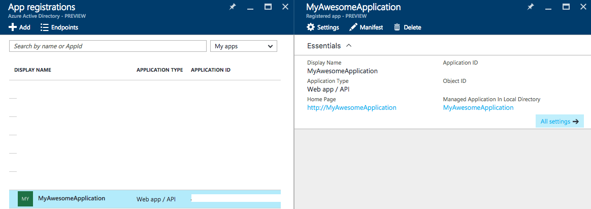

# DockerAzureSPN
[](https://microbadger.com/images/julienstroheker/dockerazurespn "Get your own image badge on microbadger.com")

Create an SPN application on your Azure Active Directory Subscription and attribute the collaborator rights on it.

## Context

If you need to interact with Microsoft Azure through some external services like Visual Studio Team Services (VSTS) 
or your own Web Application you will need to create an application to interact with your subscription.

I developed this shell script using the Azure-CLI to automate the process of creation a SPN in the desired Azure Subscription.

Output Example :

```
================== Informations about your new App ==============================
Subscription ID                    XXXXXXXX-XXXX-XXXX-XXXX-XXXXXXXXXX
Subscription Name                  Your Subscription Name
Service Principal Client ID:       XXXXXXXX-XXXX-XXXX-XXXX-XXXXXXXXXX
Service Principal Key:             YourPasswordOrGeneratingARandomOne
Tenant ID:                         XXXXXXXX-XXXX-XXXX-XXXX-XXXXXXXXXX
=================================================================================
```

## Usage

You must have docker installed and run the following command :

```
docker run -it julienstroheker/dockerazurespn <NameApp> <PasswordApp>
```

You must remplace the `<NameApp>` variable with the name of the application that you want to create and the `<PasswordApp>` with password that you want.

>Note : the `<PasswordApp>` is optional, if you are not specify one, it will generate one for you

## Example

Input :
```
$ docker run -it julienstroheker/dockerazurespn MyAwesomeApplication MyAw3s0meP@ssw0rd!
```

Output :
```
Unable to find image 'julienstroheker/dockerazurespn:latest' locally
latest: Pulling from julienstroheker/dockerazurespn

6a5a5368e0c2: Pull complete
1cbf663a5918: Pull complete
6a4443b04fec: Pull complete
647bf233c360: Pull complete
82f978178300: Pull complete
cd2904dbec59: Pull complete
Digest: sha256:4a755de5cfdada06e3a770767b40b561cea3dfd6da8592530a3ddd07eb81cf15
Status: Downloaded newer image for julienstroheker/dockerazurespn:latest
info:    Executing command login
\info:    To sign in, use a web browser to open the page https://aka.ms/devicelogin. Enter the code AAAAAAAAA to authenticate.
/info:    Added subscription YourAzureSubscription
info:    Setting subscription "YourAzureSubscription" as default
+
info:    login command OK
Successfully logged
 -------- > Pick your subscription :
1) YourAzureSubscription:6fc86853-bb67-46da-8c2f-0a5fa64cf0d6
2) YourAzureSubscriptionNumber2:a90d5dc7-03bf-456a-9cf1-0d8d9e825044
#? 1
**** Using subscription : YourAzureSubscription
*** Validating if this application is not already there... You can ignore the parse error message...
parse error: Invalid numeric literal at line 1, column 5
**** Creating AD application MyAwesomeApplication
**** Application created with ID=83f2ac82-ee7a-4535-b4e4-0c76292fca6e
**** Creating SPN
SPN created with ID=5c64533f-e974-4d7b-b100-43713349fdbc
*** Waiting 15 sec to applying for parameters
Attributing contributor role for 5c64533f-e974-4d7b-b100-43713349fdbc in subscription YourAzureSubscription

================== Informations about your new App ==============================
Subscription ID                    6fc86853-bb67-46da-8c2f-0a5fa64cf0d6
Subscription Name                  YourAzureSubscription
Service Principal Client ID:       83f2ac82-ee7a-4535-b4e4-0c76292fca6e
Service Principal Key:             MyAw3s0meP@ssw0rd!
Tenant ID:                         0803e49e-3b3f-4a23-b3f6-d7aee063906b
=================================================================================

Thanks for using this container, if you have questions or issues : https://github.com/julienstroheker/DockerAzureSPN
```

You can double check in the Azure portal, you should have : 



## Run locally without Docker - Not supported by this repo

You can run the azaddspn.sh script on your machine if you have a MAC or Linux machine.

You may need some prerequisites tools installed like : jq / awk / azure-cli...

## Issues / Questions ?

Raise issues through the github section.

You can reach me on twitter : [@Ju_Stroh](https://twitter.com/Ju_Stroh)